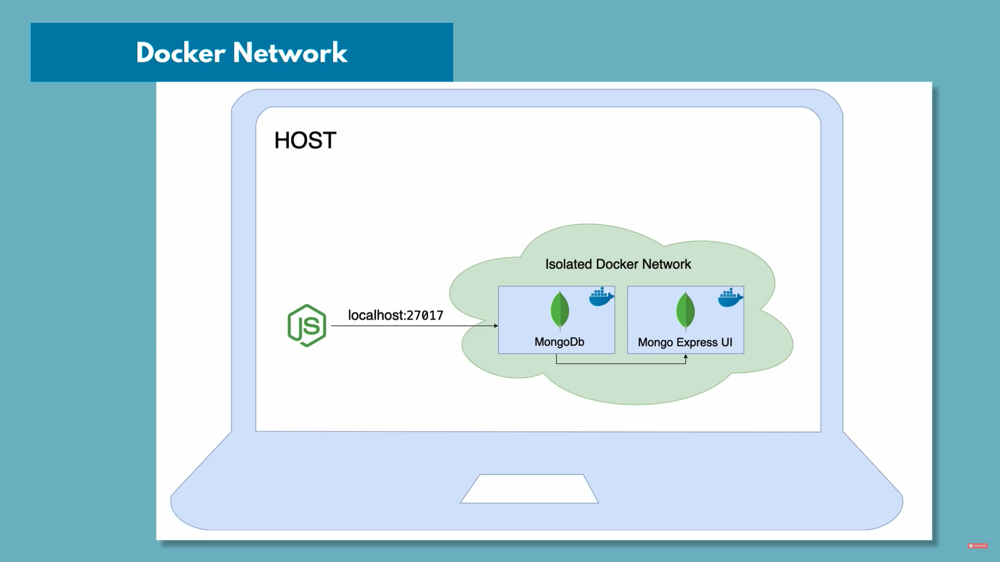

# My Programming Cheatsheets

Putting things in this file helps me to synthetize and see if I really understood concepts I've learned during my learning journey.
It can also useful as a reminder and mini tutos.
I know the title of this file not really suits its purpose ;)
Initially, it was really about doing a cheatsheet, but when I realize how benefic it was for my comprehension, I drift a bit :)

---

## Summary

- [Flowchart and Pseudocode](#flowchart-and-pseudocode)
- [Shell](#shell)
- [Git](#git)
- [RegEx](#regex)
- [Docker](#docker)
- [Python](#python)
- [HTML](#html)
- [CSS](#css)
- [Javascript](#javascript)
- [SQL](#sql)
- [MongoDB](#mongodb)

---

## Flowchart and Pseudocode

[Back to summary](#summary)  
Before writing any line of code, it is good to know exactly what your algorithm should do.  
Flowchart and pseudocode are your friend for that.  


---

## Shell

[Back to summary](#summary)

- [Shortcuts](#shortcuts)
- [Variables](#variables)
- [IO Redirection](#io-redirection)
- [pipes](#pipes)
- [Command Lists](#command-lists)
- [Directory Operations](#directory-operations)
- [ls Options](#ls-options)
- [Search Files](#search-files)
- [File Operations](#file-operations)
- [Watch a Command](#watch-a-command)
- [Process Management](#process-management)
- [Nano Shortcuts](#nano-shortcuts)
- [File Permissions](#file-permissions)
- [File Permission Numbers](#file-permission-numbers)

---

### Shortcuts

[Back to summary](#shell)

```text

CTRL-c      Stop current command
CTRL-z      Sleep program
CTRL-a      Go to start of line
CTRL-e      Go to end of line
CTRL-u      Cut from start of line
CTRL-k      Cut to end of line
CTRL-r      Search history
!!          Repeat last command
!abc        Run last command starting with abc
!abc:p      Print last command starting with abc
!$          Last argument of previous command
ALT-.       Last argument of previous command
!*          All arguments of previous command
^abc^123    Run previous command, replacing abc with 123
$_          Value of inline previous command


```

---

### Variables

[Back to summary](#shell)

```text
env                 Show environment variables
echo $NAME          Output value of $NAME variable
export NAME=value   Set $NAME to value
$PATH               Executable search path
$HOME               Home directory
$SHELL              Current shell
```

---

### IO Redirection

[Back to summary](#shell)

```text
cmd < file        Input of cmd from file
cmd1 <(cmd2)      Output of cmd2 as file input to cmd1
cmd > file        Standard output (stdout) of cmd to file
cmd > /dev/null   Discard stdout of cmd
cmd >> file       Append stdout to file
cmd 2> file       Error output (stderr) of cmd to file
cmd 1>&2          stdout to same place as stderr
cmd 2>&1          stderr to same place as stdout
cmd &> file       Every output of cmd to file
```

---

### Pipes

[Back to summary](#shell)

```text
cmd1 | cmd2       stdout of cmd1 to cmd2
cmd1 |& cmd2      stderr of cmd1 to cmd2
```

---

### Command Lists

[Back to summary](#shell)

```text
cmd1 ; cmd2     Run cmd1 then cmd2
cmd1 && cmd2    Run cmd2 if cmd1 is successful
cmd1 || cmd2    Run cmd2 if cmd1 is not successful
cmd &           Run cmd in a subshell
```

---

### Directory Operations

[Back to summary](#shell)

```text
pwd         Show current directory
mkdir dir   Make directory dir
cd dir      Change directory to dir
cd ..       Go up a directory
ls          List files
```

---

### ls Options

[Back to summary](#shell)

```text
-a    Show all (including hidden)
-R    Recursive list
-r    Reverse order
-t    Sort by last modified
-S    Sort by file size
-l    Long listing format
-1    One file per line
-m    Comma- separated output
-Q    Quoted output
```

---

### Search Files

[Back to summary](#shell)

```text
grep pattern files      Search for pattern in files
grep -i                 Case insensitive search
grep -r                 Recursive search
grep -v                 Inverted search
grep -o                 Show matched part of file only
find /dir/ -name name*  Find files starting with name in dir
find /dir/ -user name   Find files owned by name in dir
find /dir/ -mmin num    Find files modifed less than num minutes ago in dir
whereis command         Find binary/source/manual for command
locate file             Find file (quick search of system index)
```

---

### File Operations

[Back to summary](#shell)

```text
touch file1       Create file1
cat file1 file2   Concatenate files and output
less file1        View and paginate file1
file file1        Get type of file1
cp file1 file2    Copy file1 to file2
mv file1 file2    Move file1 to file2
rm file1          Delete file1
head file1        Show first 10 lines of file1
tail file1        Show last 10 lines of file1
tail -F file1     Output last lines of file1 as it changes
```

---

### Watch a Command

[Back to summary](#shell)

```text
watch -n 5 'ntpq -p'    Issue the 'ntpq -p' command every 5 seconds and display output
```

---

### Process Management

[Back to summary](#shell)

```text
ps            Show snapshot of processes
top           Show real time processes
kill pid      Kill process with id pid
pkill name    Kill process with name name
killall name  Kill all processes with names beginning name
```

---

### Nano Shortcuts

[Back to summary](#shell)

Files

```text
Ctrl-R    Read file
Ctrl-O    Save file
Ctrl-X    Close file
```

Cut and Paste

```text
ALT-A     Start marking text
CTRL-K    Cut marked text or line
CTRL-U    Paste text
```

Navigate File

```text
ALT-/     End of file
CTRL-A    Beginning of line
CTRL-E    End of line
CTRL-C    Show line number
CTRL-_    Go to line number
```

Search File

```text
CTRL-W    Find
ALT-W     Find next
CTRL-\    Search and replace
```

---

### File Permissions

[Back to summary](#shell)
Change mode of file to 775

```shell
chmod 775 file
```

Recurs ively chmod folder to 600

```shell
chmod -R 600 folder
```

Change file owner to user and group to group

```shell
chown user:group file
```

---

### File Permission Numbers

[Back to summary](#shell)  
First digit is owner permis sion, second is group and third is everyone.

```text
4   read (r)
2   write (w)
1   execute (x)
```

---

## Git

[Back to summary](#summary)

- [GIT BASICS](#git-basics)
- [SETUP](#setup)
- [NAVIGATION](#navigation)
- [SETUP & INIT](#setup-and-init)
- [STAGE & SNAPSHOT](#stage-and-snapshot)
- [BRANCH & MERGE](#branch-and-merge)
- [INSPECT & COMPARE](#inspect-and-compare)
- [TRACKING PATH CHANGES](#tracking-path-changes)
- [IGNORING PATTERNS](#ignoring-patterns)
- [SHARE & UPDATE](#share-and-update)
- [REWRITE HISTORY](#rewrite-history)
- [TEMPORARY COMMITS](#temporary-commits)
- [CONCRETE CASES](#concrete-cases)

---

### GIT BASICS

[Back to summary](#git)  
[A very simple git here](https://rogerdudler.github.io/git-guide/)


---

### SETUP

[Back to summary](#git)

Set a name that is identifiable for credit when review version history

```shell
git config --global user.name “[firstname lastname]”
```

Set an email address that will be associated with each history marker

```shell
git config --global user.email “[valid-email]”
```

Set automatic command line coloring for Git for easy reviewing

```shell
git config --global color.ui auto
git config --global color.ui true
```

---

### NAVIGATION

[Back to summary](#git)  
Shortcuts list to navigate through diff view

```text
Next line             : return
Next page             : space bar
Previous page         : w
Quit viewing the diff : q
Help                  : h
```

---

### SETUP AND INIT

[Back to summary](#git)  
Initialize an existing directory as a Git repository

```shell
git init
```

Clone a local repository

```shell
git clone <path/to/repository>
```

clone a remote directory

```shell
git clone [url]
git clone username@host:/path/to/repository
```

---

### STAGE AND SNAPSHOT

[Back to summary](#git)  
Show modified files in working directory, staged for your next commit

```shell
git status
```

Add a file as it looks now to your next commit (stage)

```shell
git add [file]
git add *
```

Unstage a file while retaining the changes in working directory

```shell
git reset [file]
```

Diff of what is changed but not staged

```shell
git diff
```

Diff of what is staged but not yet committed

```shell
git diff --staged
```

Commit your staged content as a new commit snapshot

```shell
git commit -m “[descriptive message]”
```

---

### BRANCH AND MERGE

[Back to summary](#git)  
List your branches.  
A ```*``` will appear next to the currently active branch

```shell
git branch
```

Rename Master branch to main (I can see you github)

```shell
git branch -M main
```

Create a new branch at the current commit

```shell
git branch [branch-name]
```

Switch to another branch and check it out into your working directory

```shell
git checkout
```

Merge the specified branch’s history into the current one

```shell
git merge [branch]
```

Show all commits in the current branch’s history

```shell
git log
```

Visualize log tree

```shell
git log --oneline --decorate --graph --all
```

---

### INSPECT AND COMPARE

[Back to summary](#git)  
Show the commit history for the currently active branch

```shell
git log
```

Show the commits on branchA that are not on branchB

```shell
git log branchB..branchA
```

Show the commits that changed file, even across renames

```shell
git log --follow [file]
```

Show the diff of what is in branchA that is not in branchB

```shell
git diff branchB...branchA
```

Show any object in Git in human-readable format

```shell
git show [SHA]
```

---

### TRACKING PATH CHANGES

[Back to summary](#git)  
Delete the file from project and stage the removal for commit

```shell
git rm [file]
```

Change an existing file path and stage the move

```shell
git mv [existing-path] [new-path]
```

Show all commit logs with indication of any paths that moved

```shell
git log --stat -M
```

---

### IGNORING PATTERNS

[Back to summary](#git)

Save a file with desired patterns as .gitignore with either direct string matches or wildcard globs.

```text
logs/
*.notes
pattern*/
```

System wide ignore pattern for all local repositories

```shell
git config --global core.excludesfile [file]
```

---

### SHARE AND UPDATE

[Back to summary](#git)  
Add a git URL as an alias

```shell
git remote add [alias] [url]
```

Fetch down all the branches from that Git remote

```shell
git fetch [alias]
```

Merge a remote branch into your current branch to bring it up to date

```shell
git merge [alias]/[branch]
```

Transmit local branch commits to the remote repository branch

```shell
git push [alias] [branch]
```

Fetch and merge any commits from the tracking remote branch

```shell
git pull
```

---

### REWRITE HISTORY

[Back to summary](#git)  
Apply any commits of current branch ahead of specified one

```shell
git rebase [branch]
```

Clear staging area, rewrite working tree from specified commit

```shell
git reset --hard [commit]
```

---

### TEMPORARY COMMITS

[Back to summary](#git)  
Save modified and staged changes

```shell
git stash
```

List stack-order of stashed file changes

```shell
git stash list
```

Write working from top of stash stack

```shell
git stash pop
```

Discard the changes from top of stash stack

```shell
git stash drop
```

---

### CONCRETE CASES

[Back to summary](#git)


#### Fast-Forward merge

```text
    HEAD
     |
chase-branch        escaped
     |                 |
     A <----- B <----- C

>>> git merge escaped

                    escaped
                       |
     A <----- B <----- C
                       |
                  chase-branch
                       |
                      HEAD

```

#### Change history

```text
        Branch A
          |
        HEAD
          |
A <------ B
   \
    \
      --- C
          |
        Branch B
                
>>> git rebase branch B

            Branch A
              |
            HEAD
              |
A <--- C <--- B
       |
    Branch B
```

#### Remove ignored file

- When file is ignored but is tracked for whatever reason, you can always execute ```git rm <file>``` to remove the file from both repository and working area.  
- If you want to leave it in your working directory (which is often when dealing with mistakenly tracked files), you can tell Git to remove it only from repository but not from working area with ```git rm --cached <file>```

#### Change a letter case in the filename of an already tracked file

```text
>>> git mv File.txt file.txt
>>> git commit -am "Lowercase file.txt"
```

#### Recommit based on the last commit

- When you want to change the last commit (the one that is pointed by HEAD), use ```git commit --amend```  
- If you want to change only commited files but no edit message, use ```git commit --amend --no-edit```  
- Moreover, you can skip git add command and update last commit with all current changes in working area: ```git commit --amend --no-edit -a```  
- You can even edit the date of commit using ```git commit --amend --no-edit --date="1987-08-03"```  

#### Classic branch merge

```text
        HEAD
         |
        work
         |
A <----- B
 \
  \----- C
         |
another-piece-of-work

>>> git merge another-piece-of-work

                 HEAD
                  |
                 work
                  |
A <----- B <----- D
 \               /
  \----- C <----/
         |
another-piece-of-work
```

#### Edit an old commit

Rebase and change pick by edit in front of the commit you want to edit.

```text
commit to edit
      |
      A <----- B <----- C
                        |
                  current commit
                        |
                      HEAD

>>> git rebase -i HEAD~~
```

#### Find the commits you have been

```git reflog``` records where you have been previously. You can find any commit you have been on with this tool and find commits that you have lost accidentally (for example by rebase, amend).  
There are even more powerful selectors. Do you want to know what were you working on yesterday?  
```git show -q HEAD@{1.day.ago}```

#### Split a commit

- On multiple files ```git reset HEAD~``` then add files one by one
- On a single file, do the same if index is not clean then  

```text
>>> git add -p <file>

# Here is a description of each option:
# 
#     y stage this hunk for the next commit
#     n do not stage this hunk for the next commit
#     q quit; do not stage this hunk or any of the remaining hunks
#     a stage this hunk and all later hunks in the file
#     d do not stage this hunk or any of the later hunks in the file
#     g select a hunk to go to
#     / search for a hunk matching the given regex
#     j leave this hunk undecided, see next undecided hunk
#     J leave this hunk undecided, see next hunk
#     k leave this hunk undecided, see previous undecided hunk
#     K leave this hunk undecided, see previous hunk
#     s split the current hunk into smaller hunks
#     e manually edit the current hunk
#     ? print hunk help
```

#### Too many commits

The easiest way to make one commit out of two (or more) is to squash them with ```git rebase -i``` command and choose squash option for all but the first commit you want to preserve.  
Remember that you don't need to know the commit SHA-1 hashes when specifying them in ```git rebase -i``` command. When you know that you want to go 2 commits back, you can always run ```git rebase -i HEAD^^``` or ```git rebase -i HEAD~2```.  

#### Pick branches

```text
      HEAD             ---- B - feature-b
       |              /
current-work - Z <--- A - feature-a
                      \
                       ---- C1 <--- C2 - feature-c

>>> git cherry-pick feature-a
>>> git cherry-pick feature-b
>>> git cherry-pick feature-c
# resolve merge conflict
>>> git add -A
>>> git cherry-pick --continue

                    HEAD
                     |
              pick-your-features
                     |
Z <--- A <--- B <--- C
```

#### Complex rebasing

```text
                your-master
                     |
A <--- B <--- C <--- D
        \
         E <--- F <--- G - issue-555
          \
           H <--- I
                  |
            rebase-complex
                  |
                 HEAD


>>> git rebase issue-555 --onto your-master


                                  HEAD
                  your-master      |
                     |        rebase-complex 
                     |             |
A <--- B <--- C <--- D <--- H <--- I
        \
         E <--- F <--- G - issue-555
```

Means: Take the rebase-complex branch, figure out the patches since it diverged from the issue-555 branch, and replay these patches in the rebase-complex branch as if it was based directly off the your-master branch instead.  
```git rebase --onto``` allows you to move a branch to a different place.  
```git rebase issue-555 --onto your-master``` means get all commits that are not in issue-555 and place them onto your-master branch.

```text
                                  HEAD
                  your-master      |
                     |        rebase-complex 
                     |             |
A <--- B <--- C <--- D <--- H <--- I
        \
         E <--- F <--- G - issue-555

>>> git rebase issue-555 --onto your-master

                                  HEAD
                  your-master      |
                     |        rebase-complex 
                     |             |
A <--- B <--- C <--- D <--- H <--- I
                      \
                      E <--- F <--- G - issue-555

---
```

#### Invalid commits order

With ```git rebase -i <ref>``` you can then change the order of commits

#### Check wich file was modified in the current commit

```git log -p -1```

#### Find commits where a specific word was introduced

```git log -S <word>```

#### Find bug

Let's say that the word "bug" introduced a bug, but you have introduced that word on different commits.  
You don't want to search by hand for that bug.  

- ```git bisect start``` to start bisect
- ```git bisect bad HEAD``` tells that last commit to be buggy is the current one.
- ```git bisect good 1.0``` tells that the 1.0 version and all before isn't buggy.  
- ```git bisect run sh -c "grep -v bug <file-to-test>``` tells that git must execute to all commits between the good and bad this command. Because we invert the search, we will just keep non buggy version meaning all version without the "bug" word.

## RegEx

[Back to summary](#summary)

- [Anchors](#anchors)
- [Character Classes](#character-classes)
- [POSIX](#posix)
- [Assertions](#assertions)
- [Quantifiers](#quantifiers)
- [Escape Sequences](#escape-sequences)
- [Common Metacharacters](#common-metacharacters)
- [Special Characters](#special-characters)
- [Groups and Ranges](#groups-and-ranges)
- [Pattern Modifiers](#pattern-modifiers)
- [String Replacement](#string-replacement)

---

### Anchors

[Back to summary](#regex)

```text
^           Start of string, or start of line in multiline pattern
\A          Start of string
$           End of string, or end of line in multi-line pattern
\Z          End of string
\b          Word boundary
\B          Not word boundary
\<          Start of word
\>          End of word
```

---

### Character Classes

[Back to summary](#regex)

```text
\c          Control character
\s          White space
\S          Not white space
\d          Digit
\D          Not digit
\w          Word
\W          Not word
\x          Hexadecimal digit
\O          Octal digit
```

---

### POSIX

[Back to summary](#regex)

```text
[:upper:]   Uppercase letters
[:lower:]   Lowercase letters
[:alpha:]   All letters
[:alnum:]   Digits and letters
[:digit:]   Digits
[:xdigit:]  Hexadecimal digits
[:punct:]   Punctu ation
[:blank:]   Space and tab
[:space:]   Blank characters
[:cntrl:]   Control characters
[:graph:]   Printed characters
[:print:]   Printed characters and spaces
[:word:]    Digits, letters and underscore
```

---

### Assertions

[Back to summary](#regex)

```text
?=          Lookahead assertion
?!          Negative lookahead
?<=         Lookbehind assertion
?!= or ?<!  Negative lookbehind
?>          Once-only Subexp ression
?()         Condition [if then]
?()|        Condition [if then else]
?#          Comment
```

---

### Quantifiers

[Back to summary](#regex)

```text
*           0 or more
+           1 or more
?           0 or 1
{3}         Exactly 3
{3,}        3 or more
{3,5}       3, 4 or 5
```

---

### Escape Sequences

[Back to summary](#regex)

```text
\           Escape following character
\Q          Begin literal sequence
\E          End literal sequence
```

---

### Common Metacharacters

[Back to summary](#regex)

```text
^   [   .   $
{   *   (   \
+   )   |   ?
<   >
```

---

### Special Characters

[Back to summary](#regex)

```text
\n          New line
\r          Carriage return
\t          Tab
\v          Vertical tab
\f          Form feed
\xxx        Octal character xxx
\xhh        Hex character hh
```

---

### Groups and Ranges

[Back to summary](#regex)

```text
.           Any character except new line (\n)
(a|b)       a or b
(...)       Group
(?:...)     Passive (non-c apt uring) group
[abc]       Range (a or b or c)
[^abc]      Not (a or b or c)
[a-q]       Lower case letter from a to q
[A-Q]       Upper case letter from A to Q
[0-7]       Digit from 0 to 7
\x          Group/ sub pattern number " x"
```

---

### Pattern Modifiers

[Back to summary](#regex)

```text
g           Global match
i *         Case-insensitive
m *         Multiple lines
s *         Treat string as single line
x *         Allow comments and whitespace in pattern
e *         Evaluate replacement
U *         Ungreedy pattern
```

---

### String Replacement

[Back to summary](#regex)

```text
$n          nth non-passive group
$2          "xyz" in /^(abc (xy z))$/
$1          "xyz" in /^(?:a bc) (xyz)$/
$`          Before matched string
$'          After matched string
$+          Last matched string
$&          Entire matched string
```

---

## Docker

[Back to summary](#summary)

- [docker overview](#docker-overview)
- [docker image](#docker-image)
- [docker container](#docker-container)
- [docker ports](#docker-ports)
- [docker basic commands](#docker-basic-commands)
- [docker workflow](#docker-workflow)
- [developing with containers](#developing-with-containers)
- [docker compose](#docker-compose)
- [Dockerfile](#dockerfile)
- [private docker repo with aws](#private-docker-repo-with-aws)
- [deploy containerized app](#deploy-containerized-app)
- [docker volumes](#docker-volumes)

---

### Docker overview

[Back to summary](#docker)  

(from docker's documentation)
Docker is an open platform for developing, shipping, and running applications. Docker enables you to separate your applications from your infrastructure so you can deliver software quickly. With Docker, you can manage your infrastructure in the same ways you manage your applications. By taking advantage of Docker’s methodologies for shipping, testing, and deploying code quickly, you can significantly reduce the delay between writing code and running it in production.

---

### Docker image

[Back to summary](#docker)  

An image is a read-only template with instructions for creating a Docker container. Often, an image is based on another image, with some additional customization. For example, you may build an image which is based on the ubuntu image, but installs the Apache web server and your application, as well as the configuration details needed to make your application run.

---

### Docker container

[Back to summary](#docker)  

A container is a runnable instance of an image. You can create, start, stop, move, or delete a container using the Docker API or CLI. You can connect a container to one or more networks, attach storage to it, or even create a new image based on its current state.

---

### Docker ports

[Back to summary](#docker)  


The way docker works, by default, your local machine and your container can't work together. You will have to specify a port for your container and a port for your local machine. This process is made during the ```docker run``` command. See above.  
You can't alocate two containers to the same port, that's sounds logical.

---

### Docker basic commands

[Back to summary](#docker)  

#### docker pull

To pull an image from a registery, run the following command  
```docker pull [OPTIONS] NAME[:TAG|@DIGEST]```
If no tag is specified, the version that will be pulled will be the latest.  

#### docker images

With this command ```docker images```, you can see all the images you have available on your local machine.  

#### delete an image

To delete an image, it has to be used by no container, including the not running ones.
```docker rmi imageID```

#### docker run

With this command ```docker run [OPTIONS] IMAGE[:TAG|@DIGEST] [COMMAND] [ARG...]``` you will instance the Docker image with the specified options.  
This command is for creating new a container.

- The ```-d``` option is for running container in detached mode so you will only get container reference as an output.  
- The ```--name awesomeName``` to specify the name of the container.
- To define ports bindings use ```-p3000:3001``` option. The second is the container port, the first the local's.  
- Specify the network with the following options: ```--net networkName```  
- Also, you can specify environment variables using this: ```-e VARIABLE_NAME=VALUE```  
Example:

```shell
$ docker run -d \
> -p 3000:30001 \
> -e PASSWORD=password \
> --name=my-container \
> --net my-network \
> image
```

#### docker ps

This command lets you see all containers running.  
```docker ps [-a]```  Add the ```-a``` option see every containers.  
```docker ps [OPTIONS]```

#### delete a container

To delete a container, it must be not running.
```docker rm container```

#### docker stop | start

This command lets you start or stop an existing container.  
```docker stop [containerID | containerName]```
```docker start [containerID | containerName]```

#### Fecth the logs of a container

```docker logs [OPTIONS] [containerID | containerName]```
string the logs with ```-f``` option.

#### access terminal of a container

Depending of the version of linux your container is running, use one of the following commands.  

```shell
docker exec -it [containerID | containerName] /bin/bash
docker exec -it [containerID | containerName] /bin/sh
```

---

### Docker workflow

[Back to summary](#docker)  


---

### Developing with containers

[Back to summary](#docker)  

When containers are in the same docker network, they can communicate with each others using there names.  
Applications from outside needs to use the port.


This schema is during development process. When you package your application into its own image, everything is on the same docker network, so accessable by names.  

You can see available networks using the following command ```docker network ls```  
To create a new network, use the following command ```docker network create my_network```

---

### Docker compose

[Back to summary](#docker)  

Using docker compose you can simplify the running process especially if you run multiple services that have to work together.  
Let's say you have the following commands to run your services.  

```shell
docker network create mongo-network

docker run -d \
-p 27017:27017 \
-e MONGO_INITDB_ROOT_USERNAME=admin \
-e MONGO_INITDB_ROOT_PASSWORD=password \
--net mongo-network \
--name mongodb \
mongo

docker run -d \
-p 8080:8081 \
-e ME_CONFIG_MONGODB_ADMINUSERNAME=admin \
-e ME_CONFIG_MONGODB_ADMINPASSWORD=password \
-e ME_CONFIG_MONGODB_SERVER=mongodb \
--net mongo-network \
--name mongo-express \
mongo-express
```

First, check your docker compose version.  
then create a yaml file like this:

```yaml
version:"3"
servives:
  mongodb: # MongoDB service, also sets name
    image: mongo
    ports:
      - 27017:27017
    environment:
      - MONGO_INITDB_ROOT_USERNAME=admin
      - MONGO_INITDB_ROOT_PASSWORD=password
  mongo-express: # Mongo-express service
    image: mongo-express
    ports:
      - 8080:8081
    environment:
      - ME_CONFIG_MONGODB_ADMINUSERNAME=admin
      - ME_CONFIG_MONGODB_ADMINPASSWORD=password
      - ME_CONFIG_MONGODB_SERVER=mongodb
```

To run now the yaml file, use ```docker-compose -f mongo.yaml up```: use docker-compose to read a file named mongo.yaml start sevices specified inside it.  
If no network is specified in the yaml file, a default network is created.  
To stop the services, remove the containers and the network, use ```docker-compose -f mongo.yaml down```  

---

### Dockerfile

[Back to summary](#docker)  

Dockerfile is a blueprint for building Docker images.  
The Dockerfile allows you to package your application into a Docker image.  
It also HAS TO be save as "Dockerfile" with no extension.
Assume our previous example app was in ```app/``` folder.

```Dockerfile
# install node v13.0 running on alpine
FROM node:13-alpine

# optionnaly define environment variables, 
# but its more versatile to set the docker-compose file
ENV MONGO_DB_USERNAME=admin \
    MONGO_DB_PASSWORD=password

# linux command to run
# executed once at build time and get written into your Docker image as a new layer
RUN mkdir -p /home/app

# Where to put witch files
# Here copy everything inside my local app/ directory to the home/app container directory
COPY ./app /home/app

# CMD lets you define a default command to run when your container starts.
CMD ["node", "home/app/sever.js"]
```

Now, to build the image based on the Dockerfile and the docker-compose file present in ```app/``` directory, we can run the following command:  
```docker build -t my-app:1.0 .```
Now run the image to verify that:

- application starts successfully
- application environment is configured correctly
Note that when you adjust the Dockerfile, you must rebuild the image.  

---

### private docker repo with aws

[Back to summary](#docker)  

WORK IN PROGRESS

---

### deploy containerized app

[Back to summary](#docker)  

WORK IN PROGRESS

---

### Docker volumes

[Back to summary](#docker)  

WORK IN PROGRESS

---

## Python

[Back to summary](#summary)

- [pip](#pip)
- [venv](#venv)
- [buildin functions or methods](#python-buildin-functions-or-methods)
- [lambda](#lambda)
- [generator](#generator)
- [buildin error type](#buildin-error-type)
- [assert](#assert)
- [buildin modules](#python-buildin-modules)
- [class](#class)
- [abstract class](#abstract-class)
- [database](#database)
- [file](#file)
- [Django](#django)
- [Pygame](#pygame)
- [PySimpleGUI](#pysimplegui)

---

### pip

[Back to summary](#python)  
The pip module is the default pakage manager for python, very similar to npm for node.  
To install a module

```shell
pip install <package_name>
pip3 install <package_name>
```

To update

```shell
pip install <package_name> --upgrade
pip install <package_name> -U
```

A useful module to check and update every installed module

```shell
pip install pip-review

pip-review --interactive
requests==0.14.0 is available (you have 0.13.2)
Upgrade now? [Y]es, [N]o, [A]ll, [Q]uit y
```

To unsinstall

```shell
pip uninstall <package_name>
```

Install all module from a list of modules file

```shell
pip install -r requirements.txt
```

To create that file according to what is installed (best use with virtual env)

```shell
pip freeze > requirements.txt
```

---

### venv

[Back to summary](#python)  
Create a virtual env

```shell
python -m venv venv_name
```

activate venv for that terminal session
on unix

```shell
source venv_name/bin/activate
```

on windows

```shell
source venv_name/Scripts/activate
```

to desactivate venv

```shell
deactivate
```

---

### Python buildin functions or methods

[Back to summary](#python)

- [numbers](#numbers)
- [string](#string)
- [list](#list)
- [set](#set)
- [dictionary](#dictionary)
- [all functions](#all-functions)

---

#### numbers

[Back to summary](#buildin-functions-or-methods)

```text
int Returns the integer object from a float or a string containing digits.
float Returns a floating-point number object from a number or string containing digits with decimal point or scientific notation.
complex Returns a complex number with real and imaginary components.
hex Converts a decimal integer into a hexadecimal number with 0x prefix.
oct Converts a decimal integer in an octal representation with 0o prefix.
pow Returns the power of the specified numbers.
abs Returns the absolute value of a number without considering its sign.
round Returns the rounded number.
```

---

#### string

[Back to summary](#buildin-functions-or-methods)

```text
str.capitalize() Returns the copy of the string with its first character capitalized and the rest of the letters are in lowercased.
string.casefold() Returns a lowered case string. It is similar to the lower() method, but the casefold() method converts more characters into lower case.
string.center()  Returns a new centered string of the specified length, which is padded with the specified character. The default character is space.
string.count()  Searches (case-sensitive) the specified substring in the given string and returns an integer indicating occurrences of the substring.
string.endswith() Returns True if a string ends with the specified suffix (case-sensitive), otherwise returns False.
string.expandtabs() Returns a string with all tab characters \t replaced with one or more space, depending on the number of characters before \t and the specified tab size.
string.find()  Returns the index of the first occurence of a substring in the given string (case-sensitive). If the substring is not found it returns -1.
string.index()  Returns the index of the first occurence of a substring in the given string.
string.isalnum() Returns True if all characters in the string are alphanumeric (either alphabets or numbers). If not, it returns False.
string.isalpha() Returns True if all characters in a string are alphabetic (both lowercase and uppercase) and returns False if at least one character is not an alphabet.
string.isascii() Returns True if the string is empty or all characters in the string are ASCII.
string.isdecimal() Returns True if all characters in a string are decimal characters. If not, it returns False.
string.isdigit() Returns True if all characters in a string are digits or Unicode char of a digit. If not, it returns False.
string.isidentifier() Checks whether a string is valid identifier string or not. It returns True if the string is a valid identifier otherwise returns False.
string.islower() Checks whether all the characters of a given string are lowercased or not. It returns True if all characters are lowercased and False even if one character is uppercase.
string.isnumeric() Checks whether all the characters of the string are numeric characters or not. It will return True if all characters are numeric and will return False even if one character is non-numeric.
string.isprintable() Returns True if all the characters of the given string are Printable. It returns False even if one character is Non-Printable.
string.isspace() Returns True if all the characters of the given string are whitespaces. It returns False even if one character is not whitespace.
string.istitle() Checks whether each word's first character is upper case and the rest are in lower case or not. It returns True if a string is titlecased; otherwise, it returns False. The symbols and numbers are ignored.
string.isupper() Returns True if all characters are uppercase and False even if one character is not in uppercase.
string.join()  Returns a string, which is the concatenation of the string (on which it is called) with the string elements of the specified iterable as an argument.
string.ljust()  Returns the left justified string with the specified width. If the specified width is more than the string length, then the string's remaining part is filled with the specified fillchar.
string.lower()  Returns the copy of the original string wherein all the characters are converted to lowercase.
string.lstrip()  Returns a copy of the string by removing leading characters specified as an argument.
string.maketrans() Returns a mapping table that maps each character in the given string to the character in the second string at the same position. This mapping table is used with the translate() method, which will replace characters as per the mapping table.
string.partition() Splits the string at the first occurrence of the specified string separator sep argument and returns a tuple containing three elements, the part before the separator, the separator itself, and the part after the separator.
string.replace() Returns a copy of the string where all occurrences of a substring are replaced with another substring.
string.rfind()  Returns the highest index of the specified substring (the last occurrence of the substring) in the given string.
string.rindex()  Returns the index of the last occurence of a substring in the given string.
string.rjust()  Returns the right justified string with the specified width. If the specified width is more than the string length, then the string's remaining part is filled with the specified fill char.
string.rpartition() Splits the string at the last occurrence of the specified string separator sep argument and returns a tuple containing three elements, the part before the separator, the separator itself, and the part after the separator.
string.rsplit()  Splits a string from the specified separator and returns a list object with string elements.
string.rstrip()  Returns a copy of the string by removing the trailing characters specified as argument.
string.split()  Splits the string from the specified separator and returns a list object with string elements.
string.splitlines() Splits the string at line boundaries and returns a list of lines in the string.
string.startswith() Returns True if a string starts with the specified prefix. If not, it returns False.
string.strip()  Returns a copy of the string by removing both the leading and the trailing characters.
string.swapcase() Returns a copy of the string with uppercase characters converted to lowercase and vice versa. Symbols and letters are ignored.
string.title()  Returns a string where each word starts with an uppercase character, and the remaining characters are lowercase.
string.translate() Returns a string where each character is mapped to its corresponding character in the translation table.
string.upper()  Returns a string in the upper case. Symbols and numbers remain unaffected.
string.zfill()  Returns a copy of the string with '0' characters padded to the left. It adds zeros (0) at the beginning of the string until the length of a string equals the specified width parameter.
```

---

#### list

[Back to summary](#buildin-functions-or-methods)

```text
list.append() Adds a new item at the end of the list.
list.clear() Removes all the items from the list and make it empty.
list.copy() Returns a shallow copy of a list.
list.count() Returns the number of times an element occurs in the list.
list.extend() Adds all the items of the specified iterable (list, tuple, set, dictionary, string) to the end of the list.
list.index() Returns the index position of the first occurance of the specified item. Raises a ValueError if there is no item found.
list.insert() Inserts an item at a given position.
list.pop() Returns an item from the specified index position and also removes it from the list. If no index is specified, the list.pop() method removes and returns the last item in the list.
list.remove() Removes the first occurance of the specified item from the list. It the specified item not found then throws a ValueError.
list.reverse() Reverses the index positions of the elements in the list. The first element will be at the last index, the second element will be at second last index and so on.
list.sort() Sorts the list items in ascending, descending, or in custom order.
```

---

#### set

[Back to summary](#buildin-functions-or-methods)

```text
set.add() Adds an element to the set. If an element is already exist in the set, then it does not add that element.
set.clear() Removes all the elements from the set.
set.copy() Returns a shallow copy of the set.
set.difference() Returns the new set with the unique elements that are not in the another set passed as a parameter.
set.difference_update() Updates the set on which the method is called with the elements that are common in another set passed as an argument.
set.discard() Removes a specific element from the set.
set.intersection() Returns a new set with the elements that are common in the given sets.
set.intersection_update() Updates the set on which the instersection_update() method is called, with common elements among the specified sets.
set.isdisjoint() Returns true if the given sets have no common elements. Sets are disjoint if and only if their intersection is the empty set.
set.issubset() Returns true if the set (on which the issubset() is called) contains every element of the other set passed as an argument.
set.pop() Removes and returns a random element from the set.
set.remove() Removes the specified element from the set. If the specified element not found, raise an error.
set.symmetric_difference() Returns a new set with the distinct elements found in both the sets.
set.symmetric_difference_update() Updates the set on which the instersection_update() method called, with the elements that are common among the specified sets.
set.union() Returns a new set with distinct elements from all the given sets.
set.update() Updates the set by adding distinct elements from the passed one or more iterables.
```

---

#### dictionary

[Back to summary](#buildin-functions-or-methods)

```text
dict.clear() Removes all the key-value pairs from the dictionary.
dict.copy() Returns a shallow copy of the dictionary.
dict.fromkeys() Creates a new dictionary from the given iterable (string, list, set, tuple) as keys and with the specified value.
dict.get() Returns the value of the specified key.
dict.items() Returns a dictionary view object that provides a dynamic view of dictionary elements as a list of key-value pairs. This view object changes when the dictionary changes.
dict.keys() Returns a dictionary view object that contains the list of keys of the dictionary.
dict.pop() Removes the key and return its value. If a key does not exist in the dictionary, then returns the default value if specified, else throws a KeyError.
dict.popitem() Removes and return a tuple of (key, value) pair from the dictionary. Pairs are returned in Last In First Out (LIFO) order.
dict.setdefault() Returns the value of the specified key in the dictionary. If the key not found, then it adds the key with the specified defaultvalue. If the defaultvalue is not specified then it set None value.
dict.update() Updates the dictionary with the key-value pairs from another dictionary or another iterable such as tuple having key-value pairs.
dict.values() Returns the dictionary view object that provides a dynamic view of all the values in the dictionary. This view object changes when the dictionary changes.
```

---

#### all functions

The following lists all the built-in functions of Python 3.
[Back to summary](#buildin-functions-or-methods)

```text
abs()  Returns the absolute value of the given number and returns a magnitude of a complex number.
all()  Checks whether all the elements in an iterable are truthy values or not. It returns True if all elements in the given iterable are nonzero or true. Else, it returns False.
any()  Returns True if at least one element in the given iterable is truthy value or boolean True. Returns False for empty or falsy value (such as 0, False, none).
ascii()  Returns a string containing a printable representation of an object for non-alphabats or invisible characters such as tab, carriage return, form feed etc.
bin()  Converts an integer number to a binary string prefixed with '0b'.
bool()  Converts a value to the bool class object containing either True or False
bytearray() Returns a bytearray object which is an array of the given bytes. The bytearray class is a mutable sequence of integers in the range of 0 to 256.
bytes()  Returns an immutable object of the bytes class initialized with the sequence of integers in the range of 0 to 256
callable() Returns True if the object passed is callable, False if not. In Python, classes, methods, and instances are callable because calling a class returns a new instance, instances are callable if their class includes `__call__()` method.
chr()  Returns the string representing a character whose Unicode code point is the integer
classmethod() Transforms a method into a class method
complex() Returns a complex number (an object of complex class) for the provided real value and imaginary*1j value, or converts a string or number to a complex number.
dict()  Creates a dictionary object from the specified keys and values, or iterables of keys and values or mapping objects.
delattr() Deletes the named attribute from the object if the object allows it.
dir()  Returns a list of valid attributes of the specified object. If no argument passed, it returns the list of names in the current local scope.
divmod() Returns a tuple of two numbers where first number is the quotient and the second is the remainder.
exec()  Executes the Python code block passed as a string or a code object. The string is parsed as Python statements and then executed.
enumerate() Returns an object of enumerate class for the given iterable, sequence, iterator, or object that supports iteration. The returned enumerate object contains tuples for each items of the iterable that includes an index (from start which defaults to 0) and the values obtained from iterating over iterable.
filter() Calls the specified function which returns boolen for each item of the specified iterable.
float()  Returns an object of the `float` class that represent a floating point number converted from a number or string.
format() Allows multiple substitutions and value formatting. This method lets us concatenate elements within a string through positional formatting.
frozenset() Returns an immutable set object with elements from the given iterable. Iterables can be list, set, dictionary, tuple, string.
getattr() Returns the value of the attribute of an object. If the named attribute does not exist, default is returned if provided, otherwise AttributeError is raised.
hex()  Converts an integer number to a lowercase hexadecimal string prefixed with "0x".
hash()  Returns the hash value of the specified object. The hash values are used in data storage and to access data in a small time per retrieval, and storage space only fractionally greater than the total space required for the data or records themselves. In Python, hash values are used to compare dictionary keys to access values.
hasattr() Checks if an object of the class has the specified attribute.
help()  It displays the documentation of modules, functions, classes, keywords etc.
__import__() The __import__() method is called by the import statement. This method can change the semantics of the import statement which is strongly discouraged .
id()  Returns an identity of an object. In Python, every variable or literal values are objects and each object has a unique identity as an integer number that remains constant for that object through out its life time.
int()  Returns an integer object constructed from a number or string, or return 0 if no arguments are given.
input()  Allows user to input values.
isinstance() Checks if the object is an instance of the specified class or any of its subclass.
issubclass() Checks if the specified class is the subclass of the specified subclass.
iter()  Returns an iterator object that represents a stream of data for the iterable object or sentinel.
len()  Returns the length of the object. Returns total elements in an iterable or number of chars in a string.
list()  Returns a list from an iterable passed as arguement.
map()  Applies the specified function to every item of the passed iterable, yields the results, and returns an iterator.
max()  Returns the largest value from the specified iterable or multiple arguments.
memoryview() Returns a memory view object of the given object. The memoryview object allows Python code to access the internal data of an object that supports the buffer protocol without copying.
min()  Returns the lowest value from the specified iterable or provided multiple arguments.
next()  Returns the next item from the iterator by calling its __next__() method.
object() Returns a new featureless object. The object class is the base class of all classes in Python.
oct()  Converts an integer to octal string prefixed with "0o".
open()  Opens the file (if possible) and returns the corresponding file object.
ord()  Returns an integer representing the Unicode character.
pow()  Returns the specified exponent power of a number.
print()  prints the given object to the console or to the text stream file.
property() Returns the property attribute.
range()  Returns an object of the range class which is an immutable sequence type. The `range()` method returns the imutable sequence numbers between the specified start and the stop parameter.
repr()  Returns a string containing a printable representation of an object. The repr() function calls the underlaying __repr__() function of the object.
reversed() Returns the reversed iterator of the given sequence. It is same as but in reverse order. Internally, it calls the `__reversed__()` method of the sequence class. If the given object is not a sequence, then override __reversed__() method in the class to be used with the reversed() function
round() Returns a floating-point number rounded to the specified number of decimal point.
set() Returns an object of the set class from the specified iterable and its elements. A set object is an unordered collection of distinct hashable objects. It cannot contain duplicate values. Visit [set]('/python/set') for more information.
setattr() Sets the specified value to the specified attribute of the specified object. This is the counterpart of getattr() method.
slice()  Returns a portion of an iterable as an object of the slice class based on the specified range. It can be used with string, list, tuple, set, bytes, or range objects or custom class object that implements sequence methods __getitem__() and __len__() methods.
sorted() Returns a sorted list from the items in an iterable.
str()  Returns an object of the str class with the specified value.
sum()  Returns the total of integer elements starting from left to right of the given iterable.
super()  Returns a proxy object that allows us to access methods of the base class.
tuple()  Creates an empty tuple or converts the specified iterable to a tuple.
type()  Either returns the type of the specified object or returns a new type object of the specified dynamic class, based on the specified class name, base classes and class body.
vars()  Returns the __dict__ attribute of the specified object. A __dict__ object used to store an object's writable attributes.
zip()  Takes iterables, aggregates them in a tuple, and return it.
```

---

### python buildin modules

[Back to summary](#python)

- [os](#os)
- [sys](#sys)
- [math](#math)
- [statistics](#statistics)
- [collections](#collections)
- [random](#random)
- [re](#re)

---

#### os

[Back to summary](#buildin-modules)  
It is possible to automatically perform many operating system tasks. The OS module in Python provides functions for creating and removing a directory (folder), fetching its contents, changing and identifying the current directory, etc.

```python
os.getcwd()  # get current working directory
os.mkdir("<path>") # Makes a directory at path
os.chdir("<path>") # changing current workign directory
os.rmdir("<path>") # remove the directory. Not possible with current working directory
os.listdir("<path>") # return a python list of files
os.walk("<path>") # return (dirpath, dirnames, filenames) of directory in path
```

---

#### sys

[Back to summary](#buildin-modules)  
The sys module provides functions and variables used to manipulate different parts of the Python runtime environment.

```python
sys.argv  # returns a list of command line arguments passed to a Python script. Index 0 always is the file itself
sys.exit # This causes the script to exit back to either the Python console or the command prompt.
sys.maxsize # Returns the largest integer a variable can take.
sys.path # This is an environment variable that is a search path for all Python modules.
sys.version # This attribute displays a string containing the version number of the current Python interpreter.
```

---

#### math

[Back to summary](#buildin-modules)  
Some of the most popular mathematical functions are defined in the math module. These include trigonometric functions, representation functions, logarithmic functions, angle conversion functions, etc. In addition, two mathematical constants are also defined in this module.

```python
math.pi  # return a float representing pi
math.e  # It is called Euler's number and it is a base of the natural logarithm. Its value is 2.718281828459045
math.radians(<number>) # convert <number> angle in degrees to its radians value
math.degrees(<number>) # convert <number> radians to its degrees value
math.sin(<number>) # |
math.cos(<number>) # |- trigonometric calculation
math.tan(<number>) # |
math.log(<number>) # returns the natural logarithm of a given number.
math.log10(<number>) # returns the base-10 logarithm of the given number.
math.exp(<number>) # returns a float number after raising e to the power of the given number
math.pow(<number>, <number>) # receives two float arguments, raises the first to the second and returns the result
math.sqrt(<number>) # returns the square root of a given number.
math.ceil(<number>)
math.floor(<number>)
```

---

#### statistics

[Back to summary](#buildin-modules)  
The statistics module provides functions to mathematical statistics of numeric data.

```python
statistics.mean(<list>) # calculates the arithmetic mean of the numbers in a list.
statistics.median(<list>) # returns the middle value of numeric data in a list.
statistics.mode(<list>) # returns the most common data point in the list.
statistics.stdev(<list>) # calculates the standard deviation on a given sample in the form of a list.
```

---

#### collections

[Back to summary](#buildin-modules)  
The collections module provides alternatives to built-in container data types such as list, tuple and dict.

##### namedtuple()

The namedtuple() function returns a tuple-like object with named fields. These field attributes are accessible by lookup as well as by index.

```python
student = collections.namedtuple('student', [name, age, marks])
s1 = student("Imran", 21, 98)
s1.name # "Imran"
s1[0] # same
```

---

##### OrderedDict()

The OrderedDict() function is similar to a normal dictionary object in Python. However, it remembers the order of the keys in which they were first inserted.

```python
d1 = collections.OrderedDict()
d1['A'] = 65
d1['C'] = 67
d1['B'] = 66
d1['D'] = 68

for k,v in d1.items():
    print (k,v)
"""
A 65
C 67
B 66
D 68
"""
```

---

##### deque()

A deque object support appends and pops from either ends of a list. It is more memory efficient than a normal list object. In a normal list object, the removal of any item causes all items to the right to be shifted towards left by one index. Hence, it is very slow.

```python
q=collections.deque([10,20,30,40]) # set the deque object
q.append(50) # append at the end
q.appendleft(0) # insert a the begining
q.pop() # pop last value
q.popleft() # pop first value
```

---

#### random

[Back to summary](#buildin-modules)  
The random module is a built-in module to generate the pseudo-random variables. It can be used perform some action randomly such as to get a random number, selecting a random elements from a list, shuffle elements randomly, etc.

```python
random.random() # returns a random float number between 0.0 to 1.0
random.randint(<int>,<int>) # returns a random integer between the specified integers.
random.randrange(<int>,<int>,<int>) # returns a randomly selected element from the range created by the start, stop and step arguments.
random.choice("sequence") # returns a randomly selected element from a non-empty sequence. An empty sequence as argument raises an IndexError.
random.shuffle(<list>) # method randomly reorders the elements in a list.
```

---

#### re

[Back to summary](#buildin-modules)  
The random module is a built-in module to use regular expression.  
First the meta-characters

```text
[abc] match any of the characters a, b, or c
[a-c] which uses a range to express the same set of characters.
[a-z] match only lowercase letters.
[0-9] match only digits.
\d Matches any decimal digit; this is equivalent to the class [0-9].
\D Matches any non-digit character
\s Matches any whitespace character
\S Matches any non-whitespace character
\w Matches any alphanumeric character
\W Matches any non-alphanumeric character.
. Matches with any single character except newline ‘\n'.
? match 0 or 1 occurrence of the pattern to its left
+ 1 or more occurrences of the pattern to its left
* 0 or more occurrences of the pattern to its left
\b boundary between word and non-word. /B is opposite of /b
[..] Matches any single character in a square bracket
\ It is used for special meaning characters like . to match a period or + for plus sign.
{n,m} Matches at least n and at most m occurrences of preceding
a| b Matches either a or b
```

The re.match() function in re module tries to find if the specified pattern is present at the beginning of the given string.

```python
re.match(pattern, string)
mystr = "Welcome to TutorialsTeacher"
obj1 = match("We", mystr) # return <re.Match object; span=(0, 2), match='We'> match object
obj.start() # 0
obj.end() # 2
```

The re.search() function searches for a specified pattern anywhere in the given string and stops the search on the first occurrence.

```python
string = "Try to earn while you learn"
obj = search("earn", string) # return also a match object
```

re.findall(): As against the search() function, the findall() continues to search for the pattern till the target string is exhausted. The object returns a list of all occurrences.

```python
string = "Try to earn while you learn"
obj = findall("earn", string) # return ['earn', 'earn']
```

The re.finditer() function returns an iterator object of all matches in the target string. For each matched group, start and end positions can be obtained by span() attribute.

```python
string = "Try to earn while you learn"
it = finditer("earn", string)
for match in it:
    print(match.span())
"""
(7, 11)
(23, 27)
"""
```

The re.split() function works similar to the split() method of str object in Python. It splits the given string every time a white space is found. In the above example of the findall() to get all words, the list also contains each occurrence of white space as a word. That is eliminated by the split() function in re module.

```python
string = "Flat is better than nested. Sparse is better than dense."
words = split(r' ', string) # return ['Flat', 'is', 'better', 'than', 'nested.', 'Sparse', 'is', 'better', 'than', 'dense.']
```

The re.compile() function returns a pattern object which can be repeatedly used in different regex functions. In the following example, a string 'is' is compiled to get a pattern object and is subjected to the search() method.

```python
pattern = compile(r'[aeiou]')
string = "Flat is better than nested. Sparse is better than dense."
pattern.match(string)
```

---

---

### lambda

[Back to summary](#python)  
The def keyword is used to define a function in Python. The lambda keyword is used to define anonymous functions in Python. Usually, such a function is meant for one-time use. The expression does not need to always return a value. The fonction can take multiple parameters.

```python
lambda [arguments] : expression
```

Exemple

```python
>>> def dosomething(fn):
     print('Calling function argument:')
     fn()
>>> dosomething(lambda : print('Hello World')) # passing anonymous function
Calling function argument:
Hello World
>>> myfn = lambda : print('Hello World')
>>> dosomething(myfn) # passing lambda function
```

Python has built-in functions that take other functions as arguments. The argument function can be a normal function or a lambda function.

```python
>>> sqrList = map(lambda x: x*x, [1, 2, 3, 4]) # passing anonymous function
>>> next(sqrList)
1
>>> next(sqrList)
4
>>> next(sqrList)
9
>>> next(sqrList)
16
>>> next(sqrList)
25
```

---

### generator

[Back to summary](#python)  
Python provides a generator to create your own iterator function. A generator is a special type of function which does not return a single value, instead, it returns an iterator object with a sequence of values. In a generator function, a yield statement is used rather than a return statement.  
Exemple

```python
def generator():
 yield 1
 yield 2
 yield 3

gen = generator()
next(gen) # 1
next(gen) # 2
next(gen) # 3
next(gen) # StopIteration Error
```

The below script uses the try..except block to handle the StopIteration error. It will break the while loop once it catches the StopIteration error.

```python
gen=square_of_sequence(5)
while True:
    try:
        print ("Received on next(): ", next(gen))
    except StopIteration:
        break
```

Python also provides a generator expression, which is a shorter way of defining simple generator functions. The generator expression is an anonymous generator function.

```python
squres = (x*x for x in range(5))
```

The generator expression can also be passed in a function. It should be passed without parentheses, as shown below.

```python
sum(x*x for x in range(5))
```

---

### buildin error type

[Back to summary](#python)  
The following lists important built-in exceptions in Python.

```text
AssertionError Raised when the assert statement fails.
AttributeError Raised on the attribute assignment or reference fails.
EOFError  Raised when the input() function hits the end-of-file condition.
FloatingPointError Raised when a floating point operation fails.
GeneratorExit Raised when a generator's close() method is called.
ImportError  Raised when the imported module is not found.
IndexError  Raised when the index of a sequence is out of range.
KeyError  Raised when a key is not found in a dictionary.
KeyboardInterrupt Raised when the user hits the interrupt key (Ctrl+c or delete).
MemoryError  Raised when an operation runs out of memory.
NameError  Raised when a variable is not found in the local or global scope.
NotImplementedError Raised by abstract methods.
OSError   Raised when a system operation causes a system-related error.
OverflowError Raised when the result of an arithmetic operation is too large to be represented.
ReferenceError Raised when a weak reference proxy is used to access a garbage collected referent.
RuntimeError Raised when an error does not fall under any other category.
StopIteration Raised by the next() function to indicate that there is no further item to be returned by the iterator.
SyntaxError  Raised by the parser when a syntax error is encountered.
IndentationError Raised when there is an incorrect indentation.
TabError  Raised when the indentation consists of inconsistent tabs and spaces.
SystemError  Raised when the interpreter detects internal error.
SystemExit  Raised by the sys.exit() function.
TypeError  Raised when a function or operation is applied to an object of an incorrect type.
UnboundLocalError Raised when a reference is made to a local variable in a function or method, but no value has been bound to that variable.
UnicodeError Raised when a Unicode-related encoding or decoding error occurs.
UnicodeEncodeError Raised when a Unicode-related error occurs during encoding.
UnicodeDecodeError Raised when a Unicode-related error occurs during decoding.
UnicodeTranslateError Raised when a Unicode-related error occurs during translation.
ValueError  Raised when a function gets an argument of correct type but improper value.
ZeroDivisionError Raised when the second operand of a division or module operation is zero.
```

Handle those errors with try .. except statement

```python
try:
    #statements in try block
except <error_type>: # error type is optionnal but good practice
    #executed when error in try block
else:
    #executed if try block is error-free
finally:
    #executed irrespective of exception occured or not
```

---

### assert

[Back to summary](#python)  
In Python, the assert statement is used to continue the execute if the given condition evaluates to True. If the assert condition evaluates to False, then it raises the AssertionError exception with the specified error message.

```python
assert condition [, Error Message]
```

Exemple

```python
assert x > 0, 'Only positive numbers are allowed'
```

Get only custom error message in console

```python
def square(x):
    assert x>=0, 'Only positive numbers are allowed'
    return x*x

try:
    square(-2)
except AssertionError as msg:
    print(msg)
```

---

### class

[Back to summary](#python)

- [basics](#basics)
- [class property](#class-property)
- [method](#method)
- [Inheritance](#inheritance)
- [Access modifiers](#access-modifiers)
- [decorators](#decorators)

---

#### basics

[Back to summary](#class)  
A class in Python can be defined using the class keyword.

```python
class <ClassName>:
    <statement1>
    <statement2>
    .
    .
    <statementN>
```

Class attributes are the variables defined directly in the class that are shared by all objects of the class. Class attributes can be accessed using the class name as well as using the objects.

```python
class Student:
    schoolName = 'XYZ School'

>>> Student.schoolName
'XYZ School'
>>> std = Student()
>>> std.schoolName
'XYZ School'
```

The following example demonstrates the use of class attribute count.

```python
class Student:
    count = 0
    def __init__(self):
        Student.count += 1

>>> std1=Student()
>>> Student.count
1
>>> std2 = Student()
>>> Student.count
2
```

The constructor method is invoked automatically whenever a new object of a class is instantiated.  
The constructor must have a special name \_\_init\_\_() and a special parameter called self.  
Instance attributes are attributes or properties attached to an instance of a class. Instance attributes are defined in the constructor.  
You can specify the values of instance attributes through the constructor. The following constructor includes the name and age parameters, other than the self parameter.  
You can also set default values to the instance attributes.

```python
class Student:
    def __init__(self, name, gender="Male"): # constructor method
        print('Constructor invoked')
  self.name = name
  self.type = "Student"
  self.gender = gender
```

You can delete attributes, objects, or the class itself, using the del keyword, as shown below.

```python
>>> std = Student('Steve', 25)
>>> del std.name # deleting attribute
>>> std.name
Traceback (most recent call last):
File "<pyshell#42>", line 1, in <module>
std.name
AttributeError: 'Student' object has no attribute 'name'
>>> del std  # deleting object
>>> std.name
Traceback (most recent call last):
File "<pyshell#42>", line 1, in <module>
std.name
NameError: name 'std' is not defined
>>> del Student  # deleting class
>>> std = Student('Steve', 25)
Traceback (most recent call last):
File "<pyshell#42>", line 1, in <module>
std = Student()
NameError: name 'Student' is not defined
```

---

#### class property

[Back to summary](#class)  
In Python, a property in the class can be defined using the property() function.  
The property() method in Python provides an interface to instance attributes. It encapsulates instance attributes and provides a property, same as Java and C#.  
The property() method takes the get, set and delete methods as arguments and returns an object of the property class.

```python
class Student:
    def __init__(self):
        self.__name=''
    def setname(self, name):
        print('setname() called')
        self.__name=name
    def getname(self):
        print('getname() called')
        return self.__name
    name=property(getname, setname)
```

In the above example, property(getname, setname) returns the property object and assigns it to name. Thus, the name property hides the private instance attribute \_\_name. The name property is accessed directly, but internally it will invoke the getname() or setname() method, as shown below.  
It is recommended to use the property decorator instead of the property() method.

```python
>>> std = Student()
>>> std.name="Steve"
setname() called
>>> std.name
getname() called
'Steve'
```

---

#### method

[Back to summary](#class)  
You can define as many methods as you want in a class using the def keyword.  
Each method must have the first parameter, generally named as self, which refers to the calling instance.  
Self is just a conventional name for the first argument of a method in the class. A method defined as mymethod(self, a, b) should be called as x.mymethod(a, b) for the object x of the class.  
Defining a method in the class without the self parameter would raise an exception when calling a method.  
The method can access instance attributes using the self parameter.

```python
class Student:
    def __init__(self, name, age):
        self.name = name
        self.age = age
    def displayInfo(self): # class method
        print('Student Name: ', self.name,', Age: ', self.age)

>>> std = Student('Steve', 25)
>>> std.displayInfo()
Student Name: Steve , Age: 25
```

---

#### Inheritance

[Back to summary](#class)  
The child class inherits data definitions and methods from the parent class. This facilitates the reuse of features already available. The child class can add a few more definitions or redefine a base class method.

```python
class parent:
    def __init__(self, name):
  self.name = name

class child(parent):
 def __init__(self, name, age):
  super().__init__(name) # The __init__() method forwards the parameters to the constructor of its parent class using the super() function.
  self.age = age
```

To override a method, simply define a new one with the same name inside the child class.

---

#### Access modifiers

[Back to summary](#class)  
Classical object-oriented languages, such as C++ and Java, control the access to class resources by public, private, and protected keywords. Private members of the class are denied access from the environment outside the class. They can be handled only from within the class.

---

##### public members

Public members (generally methods declared in a class) are accessible from outside the class. The object of the same class is required to invoke a public method. This arrangement of private instance variables and public methods ensures the principle of data encapsulation.  
All members in a Python class are public by default. Any member can be accessed from outside the class environment.

```python
class Student:
    schoolName = 'XYZ School' # class attribute

    def __init__(self, name, age):
        self.name=name # instance attribute
        self.age=age # instance attribute

>>> std = Student("Steve", 25)
>>> std.schoolName
'XYZ School'
>>> std.name
'Steve'
>>> std.age = 20
>>> std.age
20
```

---

##### protected members

Protected members of a class are accessible from within the class and are also available to its sub-classes. No other environment is permitted access to it. This enables specific resources of the parent class to be inherited by the child class.  
Python's convention to make an instance variable protected is to add a prefix \_ (single underscore) to it. This effectively prevents it from being accessed unless it is from within a sub-class.  
In fact, this doesn't prevent instance variables from accessing or modifying the instance. You can still perform the following operations:

```python
class Student:
    _schoolName = 'XYZ School' # protected class attribute

    def __init__(self, name, age):
        self._name=name  # protected instance attribute
        self._age=age # protected instance attribute

>>> std = Student("Swati", 25)
>>> std._name
'Swati'
>>> std._name = 'Dipa'
>>> std._name
'Dipa'
```

However, you can define a property using property decorator and make it protected, as shown below.  
Without the setter, you won't be able to modify \_name like this "std.name = 'another name'", but you can still modify directly \_name value.
Hence, the responsible programmer would refrain from accessing and modifying instance variables prefixed with \_ from outside its class.

```python
class Student:
 def __init__(self,name):
  self._name = name
 @property
 def name(self):
  return self._name
 @name.setter
 def name(self,newname):
  self._name = newname

>>> std = Student("Swati")
>>> std.name
'Swati'
>>> std.name = 'Dipa'
>>> std.name
'Dipa'
>>> std._name # still accessible
```

---

##### Private members

Python doesn't have any mechanism that effectively restricts access to any instance variable or method. Python prescribes a convention of prefixing the name of the variable/method with a single or double underscore to emulate the behavior of protected and private access specifiers.  
The double underscore \_\_ prefixed to a variable makes it private. It gives a strong suggestion not to touch it from outside the class. Any attempt to do so will result in an AttributeError:

```python
class Student:
    __schoolName = 'XYZ School' # private class attribute

    def __init__(self, name, age):
        self.__name=name  # private instance attribute
        self.__salary=age # private instance attribute
    def __display(self):  # private method
     print('This is private method.')

>>> std = Student("Bill", 25)
>>> std.__schoolName
AttributeError: 'Student' object has no attribute '__schoolName'
>>> std.__name
AttributeError: 'Student' object has no attribute '__name'
>>> std.__display()
AttributeError: 'Student' object has no attribute '__display'
```

Python performs name mangling of private variables. Every member with a double underscore will be changed to \_object.\_class\_\_variable. So, it can still be accessed from outside the class, but the practice should be refrained.  
Thus, Python provides conceptual implementation of public, protected, and private access modifiers, but not like other languages like C#, Java, C++.

```python
>>> std = Student("Bill", 25)
>>> std._Student__name
'Bill'
>>> std._Student__name = 'Steve'
>>> std._Student__name
'Steve'
>>> std._Student__display()
'This is private method.'
```

---

### decorators

[Back to summary](#class)

- [introduction](#introduction)
- [property](#property)
- [classmethod](#classmethod)
- [staticmethod](#staticmethod)

---

#### introduction

[Back to summary](#decorators)  
In programming, decorator is a design pattern that adds additional responsibilities to an object dynamically. In Python, a function is the first-order object. So, a decorator in Python adds additional responsibilities/functionalities to a function dynamically without modifying a function.  
In Python, a function can be passed as an argument to another function. It is also possible to define a function inside another function, and a function can return another function.
So, a decorator in Python is a function that receives another function as an argument. The behavior of the argument function is extended by the decorator without actually modifying it. The decorator function can be applied over a function using the @decorator syntax.

```python
def mydecorator(fn):
 fn()
 print('How are you?')

def greet():
 print('Hello! ', end='')
>>> greet()
Hello!

@mydecorator
def greet():
 print('Hello! ', end='')
>>> greet()
Hello! How are you?
```

---

#### property

[Back to summary](#decorators)  
The \@property decorator is a built-in decorator in Python for the property() function. Use @property decorator on any method in the class to use the method as a property.  
You can use the following three decorators to define a property:

- @property: Declares the method as a property.
- @<property-name\>.setter: Specifies the setter method for a property that sets the value to a property.
- @<property-name\>.deleter: Specifies the delete method as a property that deletes a property.

```python
class Student:
    def __init__(self, name):
        self.__name = name

    @property
    def name(self):
        return self.__name

    @name.setter
    def name(self, value):
        self.__name=value

    @name.deleter   #property-name.deleter decorator
    def name(self, value):
        print('Deleting..')
        del self.__name

>>> s = Student('Steve')
>>> s.name
'Steve'
>>> s.name = 'Bill'
'Bill'
>>> del s.name
Deleting..
>>> s.name
Traceback (most recent call last):
File "<pyshell#16>", line 1, in <module>
    p.name
File "C:\Python37\test.py", line 6, in name
    return self.__name
AttributeError: 'Student' object has no attribute '_Student__name'
```

---

#### classmethod

[Back to summary](#decorators)  
In Python, the @classmethod decorator is used to declare a method in the class as a class method that can be called using ClassName.MethodName(). The class method can also be called using an object of the class.  
The @classmethod is an alternative of the classmethod() function. It is recommended to use the @classmethod decorator instead of the function because it is just a syntactic sugar.  
@classmethod Characteristics:

- Declares a class method.
- The first parameter must be cls, which can be used to access class attributes.
- The class method can only access the class attributes but not the instance attributes.
- The class method can be called using ClassName.MethodName() and also using object.
- It can return an object of the class.
  The class method can only access class attributes, but not the instance attributes. It will raise an error if trying to access the instance attribute in the class method.

```python
class Student:
    name = 'unknown' # class attribute
    def __init__(self):
        self.age = 20  # instance attribute

    @classmethod
    def tostring(cls):
        print('Student Class Attributes: name=',cls.name)
```

The class method can also be used as a factory method to get an object of the class, as shown below.

```python
class Student:

    def __init__(self, name, age):
        self.name = name  # instance attribute
        self.age = age # instance attribute

    @classmethod
    def getobject(cls):
        return cls('Steve', 25)
```

---

#### staticmethod

[Back to summary](#decorators)  
The @staticmethod is a built-in decorator that defines a static method in the class in Python. A static method doesn't receive any reference argument whether it is called by an instance of a class or by the class itself.  
@staticmethod Characteristics

- Declares a static method in the class.
- It cannot have cls or self parameter.
- The static method cannot access the class attributes or the instance attributes.
- The static method can be called using ClassName.MethodName() and also using object.MethodName().
- It can return an object of the class.

```python
class Student:
    name = 'unknown' # class attribute

    def __init__(self):
        self.age = 20  # instance attribute

    @staticmethod
    def tostring():
        print('Student Class')
```

---

### abstract class

[Back to summary](#python)  
A class is called an Abstract class if it contains one or more abstract methods. An abstract method is a method that is declared, but contains no implementation. Abstract classes may not be instantiated, and its abstract methods must be implemented by its subclasses.  
'abc' works by marking methods of the base class as abstract. This is done by @absttractmethod decorator. A concrete class which is a sub class of such abstract base class then implements the abstract base by overriding its abstract methods.  
The abc module defines ABCMeta class which is a metaclass for defining abstract base class. Following example defines Shape class as an abstract base class using ABCMeta. The shape class has area() method decorated by abstractmethod.  
A Rectangle class now uses above Shape class as its parent and implementing the abstract area() method. Since it is a concrete class, it can be instantiated and imlemented area() method can be called.

```python
import abc
class Shape(metaclass=abc.ABCMeta):
   @abc.abstractmethod
   def area(self):
      pass


class Rectangle(Shape):
   def __init__(self, x,y):
      self.l = x
      self.b = y
   def area(self):
      return self.l * self.b


r = Rectangle(10, 20)
print ('area: ', r.area())
```

_Note the abstract base class may have more than one abstract methods. The child class must implement all of them failing which TypeError will be raised._

The abc module also defines ABC helper class which can be used instead of ABCMeta class in definition of abstract base class.  
Instead of subclassing from abstract base class, it can be registered as abstract base by register class decorator.

```python
class Shape(abc.ABC):
   @abc.abstractmethod
   def area(self):
      pass

@Shape.register
class Rectangle():
   def __init__(self, x,y):
   self.l = x
   self.b = y
   def area(self):
      return self.l * self.b
```

---

### database

[Back to summary](#python)  
Python DB-API is a set of standards recommended by a Special Interest Group for database module standardization. Python modules that provide database interfacing functionality with all major database products are required to adhere to this standard.  
Standard Python distribution has in-built support for SQLite database connectivity. It contains sqlite3 module which adheres to DB-API 2.0 and is written by Gerhard Haring. Other RDBMS products also have DB-API compliant modules:

- MySQL: PyMySql module
- Oracle: Cx-Oracle module
- SQL Server: PyMsSql module
- PostGreSQL: psycopg2 module
- ODBC: pyodbc module
- MondoDB: PyMongo module  
  Read documentation for more informations

---

### file

[Back to summary](#python)  
In Python, the IO module provides methods of three types of IO operations; raw binary files, buffered binary files, and text files.

---

#### Read files

Use the 'rb' mode in the open() function to read a binary files

```python
with open('C:\myfile.txt') as f # opening a file
 lines = f.read() # reading a file

with open('C:\myfile.txt') as f # opening a file
 line1 = f.readline() # reading a line
 line2 = f.readline() # reading a line

with open('C:\myfile.txt') as f # opening a file
 lines = f.readlines() # return a list. each item of the list is a line of the file

with open('C:\myfile.txt') as f # opening a file
 for line in f:
     print(line)
```

---

##### Write

- write(s): Write the string s to the stream and return the number of characters written.
- writelines(lines): Write a list of lines to the stream. Each line must have a separator at the end of it.

```python
with open('C:\myfile.txt', "w") as f # opening a file with write permission
 f.write("Hello") # overwriting to file and return 5

with open('C:\myfile.txt', "a") as f # opening a file with write permission and appedind mode
 f.write("Hello") # append to file and return 5

with open('C:\myfile.txt', "w") as f # opening a file with write permission
 f.writelines(lines)

with open('C:\binfile.bin', "wb") as f # opening a file with write permission and binary mode
 num=[5, 10, 15, 20, 25]
 arr=bytearray(num)
 f.write(arr)
```

---

### Django

[Back to summary](#python)

- [Preparing Environnement](#preparing-environnement)
- [Create project](#create-project)
- [Database Setup](#database-setup)
- [Creating an app](#creating-an-app)
- [Creating models](#creating-models)
- [Database editing](#database-editing)
- [Administration](#administration)
- [Management](#management)
- [Views](#views)
- [Add some static files](#add-some-static-files)
- [Render Form In Template](#render-form-in-template)
- [Custom template tags and filters](#custom-template-tags-and-filters)
- [Setting Up User Accounts](#setting-up-user-accounts)
- [Allow Users to Own Their Data](#allow-users-to-own-their-data)
- [Paginator](#paginator)
- [Deploy to Heroku](#deploy-to-heroku)

---

#### Preparing Environnement

[back to summary](#django)  
Create project folder and navigate to it

```shell
mkdir project_name && cd $_
```

Create venv for the project

```shell
python -m venv env_name   # PC
python3 -m venv env_name  # Mac
```

Activate environnement (Replace "bin" by "Scripts" in Windows)

```shell
source env_name\bin\activate     # Mac
source env_name\Scripts\activate # PC
```

Install Django (and others dependencies if needed)

```shell
pip install django
```

Create requirements file

```shell
pip freeze > requirements.txt
```

Use this commmand to install all required files based on your pip freeze command

```shell
pip install -r requirements.txt
```

Version control initialisation, be sure to create appropriate gitignore

```shell
git init
```

---

#### Create project

[back to summary](#django)  
This will create a mysite directory in your current directory the manage.py file

```shell
django-admin startproject mysite (or I like to call it config)
```

You can check that everything went fine

```shell
python manage.py runserver
```

---

#### Database Setup

[back to summary](#django)  
Open up mysite/settings.py. It’s a normal Python module with module-level variables representing Django settings.  
If you wish to use another database, install the appropriate database bindings and change the following keys in the DATABASES 'default' item to match your database connection settings

```python
ENGINE – 'django.db.backends.sqlite3', 'django.db.backends.postgresql', 'django.db.backends.mysql', or 'django.db.backends.oracle'
```

The default value, BASE_DIR / 'db.sqlite3', will store the file in your project directory  
NAME – The name of your database. If you’re using SQLite, the database will be a file on your computer; in that case, NAME should be the full absolute path, including filename, of that file.  
The default value, BASE_DIR / 'db.sqlite3', will store the file in your project directory.  
If you are not using SQLite as your database, additional settings such as USER, PASSWORD, and HOST must be added.  
For more details, see the reference documentation for [DATABASES](https://docs.djangoproject.com/en/4.0/ref/settings/#std:setting-DATABASES).

---

#### Creating an app

[back to summary](#django)  
Create an app_name directory and all default file/folder inside

```shell
python manage.py startapp app_name
```

Apps are "plugable", "plug in" the app into the project by adding it in installed apps in settings.py

```python
INSTALLED_APPS = [
 'app_name',
 ...
```

Into urls.py from project folder, inculde app urls to project

```python
urlpatterns = [
 path('app_name/', include('app_name.urls')),
 path('admin/', admin.site.urls),
]
```

---

#### Creating models

[back to summary](#django)  
Create your class in the app_name/models.py file and add [fields](https://docs.djangoproject.com/en/3.2/ref/models/fields/).  
It’s important to add **str**() methods to your models, because objects’ representations are used throughout Django’s automatically-generated admin.

```python
from django.db import models

Class ModelName(models.Model):
  """A very basic model"""
  title = models.CharField(max_length=100) #max-length is required with charfiel

  def __str__(self):
    return self.title
```

---

#### Database editing

[back to summary](#django)  
By running makemigrations, you’re telling Django that you’ve made some changes to your models
you can specify app_name or not

```shell
python manage.py makemigrations (app_name)
```

Check the SQL commands that migration would run (identifier is given with makemigrations command).

```shell
python manage.py sqlmigrate #identifier
```

Check for any problems in your project without migrate database

```shell
python manage.py check
```

Create tables and fields in database based on your models

```shell
python manage.py migrate
```

Hop into the interactive Python shell and play around with the free API Django gives you

```shell
python manage.py shell
```

---

#### Administration

[back to summary](#django)  
Create a user who can login to the admin site

```shell
python manage.py createsuperuser
```

Into app_name/admin.py, add the model to administration site

```python
from django.contrib import admin
from .models import ModelName

admin.site.register(ModelName)
```

Open a web browser and go to “/admin/” on your local domain

---

#### Management

[back to summary](#django)  
Django allows you to create customs CLI commands.  
First, create required folders

```shell
mkdir app_name/management app_name/management/commands && cd $_
```

Create a python file with your command name

```shell
touch your_command_name.py
```

Edit your new python file. Create a class that will handle your command.

```python
from django.core.management.base import BaseCommand
# import anything else you need to work with (models?)

class Command(BaseCommand):
  help = "This message will be shown with the --help option after your command"

  def handle(self, args, *kwargs):
   # Task the command is supposed to do
```

You can now execute your command

```shell
python manage.py my_custom_command
```

---
